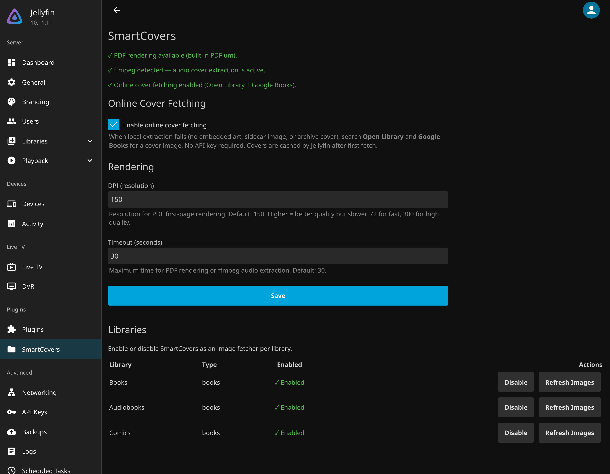

# Getting started

## From Plugin Repository (Recommended)

Add the following repository URL in **Dashboard > Plugins > Repositories**:

```
https://geiserx.github.io/smart-covers/manifest.json
```

Then install **SmartCovers** from the plugin catalog and restart Jellyfin.

## From Releases

1. Download `smart-covers_<version>.zip` from the [latest release](https://github.com/GeiserX/smart-covers/releases/latest). The version is the tag without the `v`, for example `7.4.0.0`.
2. Extract the contents into your Jellyfin plugins directory:
   ```text
   <jellyfin-config>/plugins/SmartCovers_<version>/
   ```
   The zip contains `SmartCovers.dll` (with the CBZ/CBR archive reader merged in), `PDFtoImage.lib` (the PDFtoImage managed library, shipped with a `.lib` extension so Jellyfin's plugin scanner skips it), native PDFium libraries for all platforms under `runtimes/<rid>/native/`, and `THIRD-PARTY-NOTICES.md`.
3. Restart Jellyfin.

## Building from Source

```bash
dotnet publish SmartCovers/SmartCovers.csproj -c Release -o publish
```

The plugin targets .NET 9.0. The output will be in the `publish/` directory. Merge SharpCompress into the main assembly (`ilrepack /internalize /out:SmartCovers.dll publish/SmartCovers.dll publish/SharpCompress.dll` — a separate `SharpCompress.dll` makes Jellyfin 10.11 mark the plugin NotSupported, because nothing can resolve the reference during the plugin scan), then copy the merged `SmartCovers.dll`, the PDFtoImage managed library (renamed `PDFtoImage.dll` → `PDFtoImage.lib` so Jellyfin's plugin scanner skips it), and the `runtimes/` folder containing native PDFium libraries to your plugins directory.

## Turn it on per library

Jellyfin does not switch a new image fetcher on by itself, and a library you created before the install keeps its
old fetcher list. Open **Dashboard > SmartCovers**, click **Enable** on each library, then **Refresh Images**.
The same switch is in each library's own settings under Image fetchers, as **SmartCovers**.



## Check that it works

- The SmartCovers page shows three green lines: PDF rendering available, ffmpeg detected, online cover fetching
  enabled. An orange line names what is missing and every other format keeps working.
- Covers appear on the tiles while the refresh runs. Open the library and reload after a minute.
- Anything still blank is retried by **Refresh items missing a cover** (Dashboard > Scheduled Tasks, category
  SmartCovers) every night at 04:00; run it by hand from that page to retry now.

## Requirements

| Dependency | Required For | Notes |
|------------|-------------|-------|
| Jellyfin 10.11+ | All features | Minimum supported server version |
| `ffmpeg` | Audio covers | Bundled with Jellyfin Docker images |
| [Bookshelf plugin](https://github.com/jellyfin/jellyfin-plugin-bookshelf) v13+ | EPUB covers | Recommended; handles standard EPUB covers as primary provider |

PDF rendering requires no external dependencies: the native PDFium library is bundled with the plugin for all platforms (Linux x64/arm64/musl, macOS x64/arm64, Windows x64/x86/arm64). CBZ/CBR extraction is pure managed code (SharpCompress, merged into `SmartCovers.dll`) and works everywhere with no external dependencies either.
