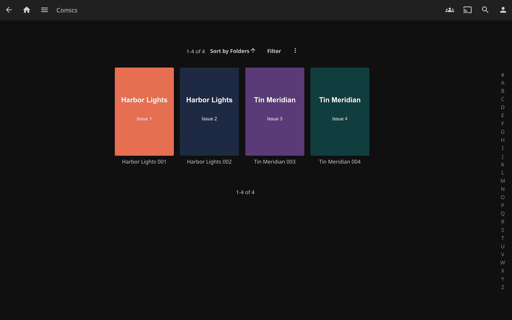
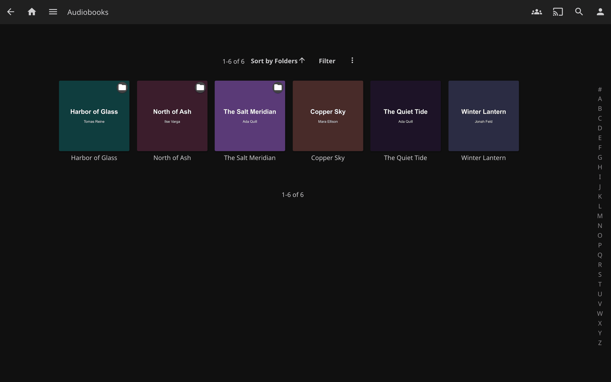
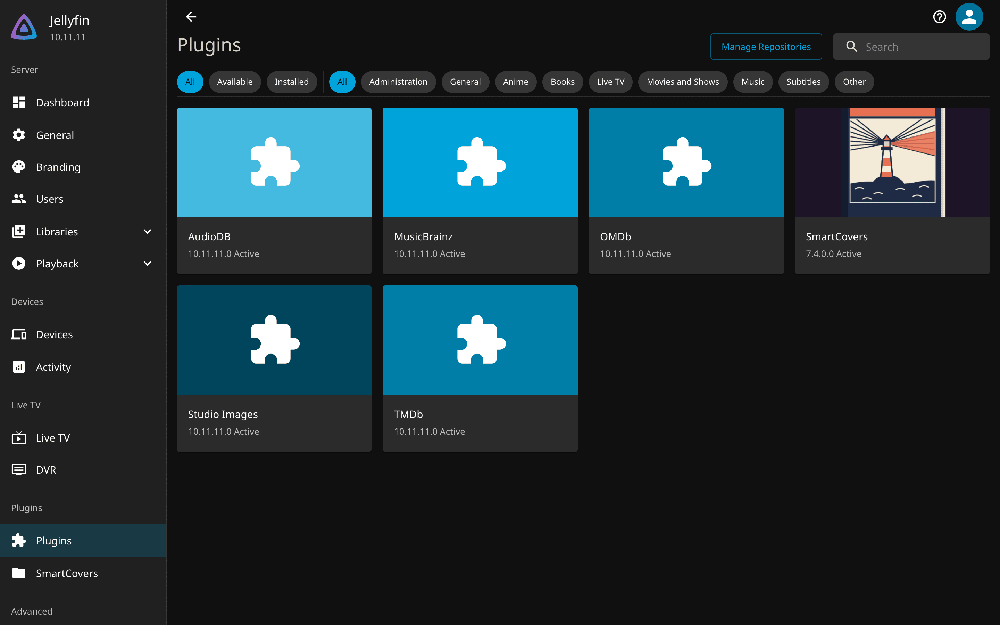

---
hide:
  - navigation
---

# smart-covers { .sc-visually-hidden }

<p align="center">
  
</p>

<p align="center">
  <a href="https://github.com/GeiserX/smart-covers/releases"></a>
  <a href="https://github.com/GeiserX/smart-covers/stargazers"></a>
  <a href="https://github.com/GeiserX/smart-covers/releases/latest"></a>
  <a href="https://github.com/GeiserX/smart-covers/blob/main/LICENSE"></a>
</p>

---

**smart-covers** is a Jellyfin plugin that gives a cover to the books, comics and audiobooks Jellyfin leaves blank. It takes the cover from the file itself (the first page of a PDF or comic, the cover image inside an EPUB or MOBI, the art embedded in an audio file), and when the file has none it asks Open Library and then Google Books, with no API key. It appears in the catalog and the dashboard as **SmartCovers** and runs on Jellyfin 10.11 or newer. Start with [Getting started](getting-started.md), then [turn it on per library](getting-started.md#turn-it-on-per-library).

Add this catalog under **Dashboard > Plugins > Repositories**, then install **SmartCovers** and restart Jellyfin:

```text
https://geiserx.github.io/smart-covers/manifest.json
```

<div class="grid cards" markdown>

-   :material-download: **[Install](getting-started.md)**

    ---

    The catalog URL, the release zip, and what the plugin needs from the server.

-   :material-toggle-switch: **[Turn it on per library](getting-started.md#turn-it-on-per-library)**

    ---

    Enable, Refresh Images, and what a healthy SmartCovers page looks like.

-   :material-book-open-page-variant: **[How it works](how-it-works.md)**

    ---

    How each format is read, the online lookup, and the daily task that retries misses.

-   :material-tune: **[Configuration](configuration.md)**

    ---

    Every setting, its default, and the per-library switch.

</div>

## What you get


<div class="sc-shot-gallery" markdown>
<figure markdown>

<figcaption>Comics: the first page of each CBZ or CBR</figcaption>
</figure>
<figure markdown>

<figcaption>Audiobooks: folders, multi-disc rips and single files</figcaption>
</figure>
<figure markdown>

<figcaption>Dashboard > SmartCovers: three green lines and one switch per library</figcaption>
</figure>
<figure markdown>

<figcaption>The plugin as Jellyfin lists it</figcaption>
</figure>
</div>

## What gets a cover

- **PDF**: the first page, rendered by a bundled PDFium. Nothing to install on the server.
- **EPUB**: the image named as the cover, else any image with `cover` in its path, else the largest image in the archive.
- **MOBI, AZW, AZW3**: the cover record stored in the file.
- **CBZ and CBR**: the image named as the cover, else the first page in natural order. RAR4, RAR5 and solid archives work, and so does a RAR renamed to `.cbz`.
- **MP3, M4A/M4B, FLAC, OGG/Opus, WMA, AAC, WAV**: the embedded art, including art tagged with the wrong image format, which Jellyfin's own extractor drops.
- **A folder of tracks**: one cover for the book, from a sidecar image or the first track, multi-disc rips included.
- **Anything with no cover inside**: Open Library, then Google Books, by title and author.

## How it runs

- SmartCovers is an image provider inside Jellyfin. Jellyfin asks it for a cover when it scans a book, audiobook or track that has none, and stores what comes back like any other fetched image. Your files are never changed.
- It is off on every library until you click **Enable** on the SmartCovers page, including libraries you create later. See [Turn it on per library](getting-started.md#turn-it-on-per-library).
- Jellyfin asks once per item. Items that were already in the library, or that missed while a catalogue was down, are retried by the **Refresh items missing a cover** task every night at 04:00, or by hand from Dashboard > Scheduled Tasks. See [Refreshing covers that were missed](how-it-works.md#refreshing-covers-that-were-missed).
- Four settings: online fetching on or off, PDF DPI, JPEG quality and a per-file timeout. See [Configuration](configuration.md).

## What it does not do

- It never replaces a cover that exists. If Jellyfin, Bookshelf or another provider already supplied one, SmartCovers is not asked; delete that cover and refresh to force it.
- It does not run on a library where it is not enabled, and it does not cover items scanned before it was enabled until a refresh or the nightly task reaches them.
- A file with no cover inside, with online fetching off, stays blank.

## Privacy

- Reading a PDF, EPUB, MOBI, comic or audio file happens on your server. Nothing leaves it.
- The online lookup, on by default, sends the item's title and author to `openlibrary.org` and `googleapis.com` and downloads the matching cover. Switch it off on the SmartCovers page and nothing is sent.

## Getting help

- Something broken: read [Troubleshooting](troubleshooting.md), then open an [issue](https://github.com/GeiserX/smart-covers/issues) with the details its last section lists.
- A security problem: follow the [security policy](https://github.com/GeiserX/smart-covers/blob/main/SECURITY.md), never a public issue.
- Building from source, tests, what ships in the zip and how a release reaches the catalog: [Development](development.md).

## License

smart-covers is released under the [GPL-3.0-or-later](https://github.com/GeiserX/smart-covers/blob/main/LICENSE) license. Bundled third-party components are listed in [THIRD-PARTY-NOTICES.md](https://github.com/GeiserX/smart-covers/blob/main/THIRD-PARTY-NOTICES.md).
